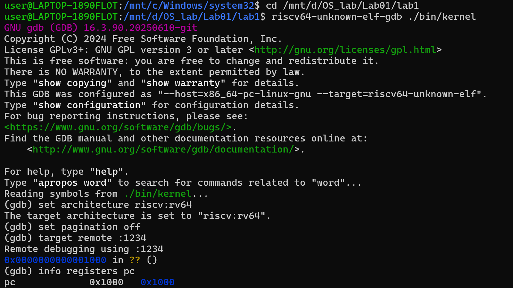
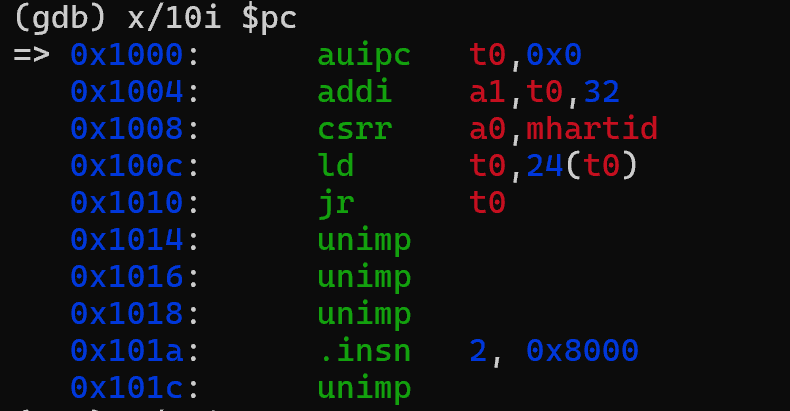
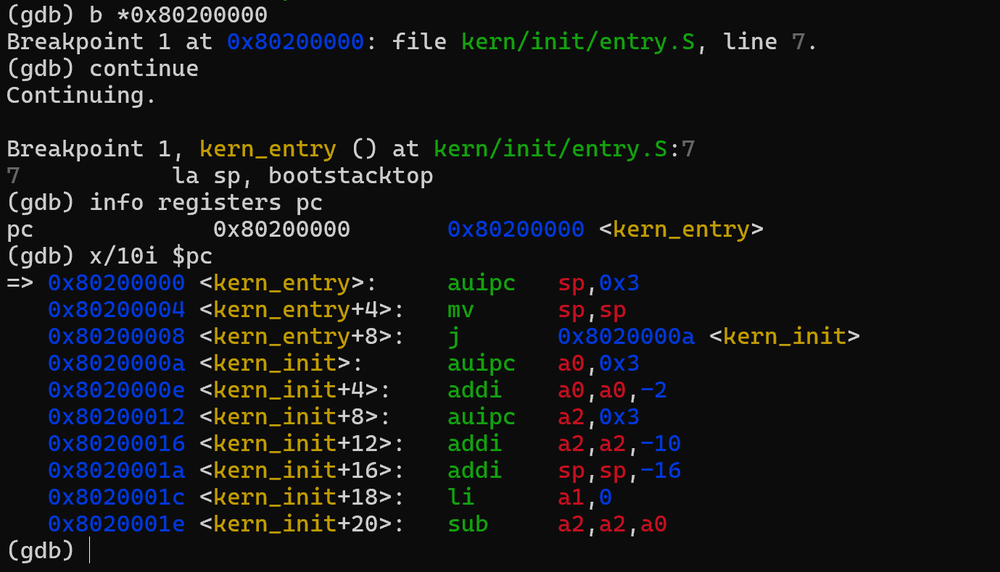
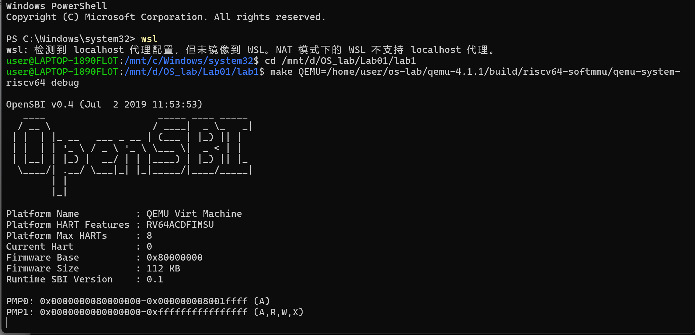
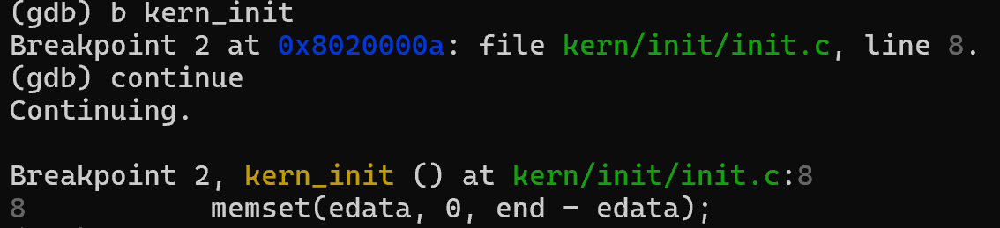
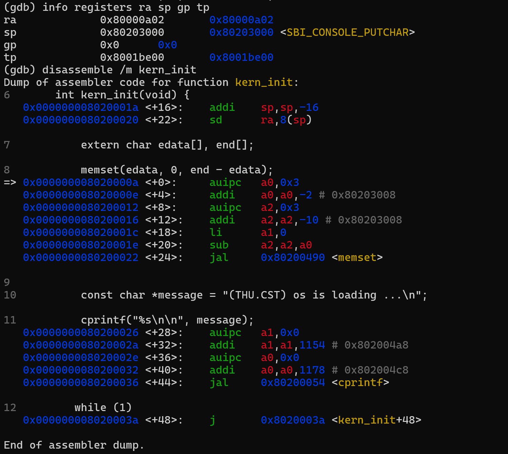
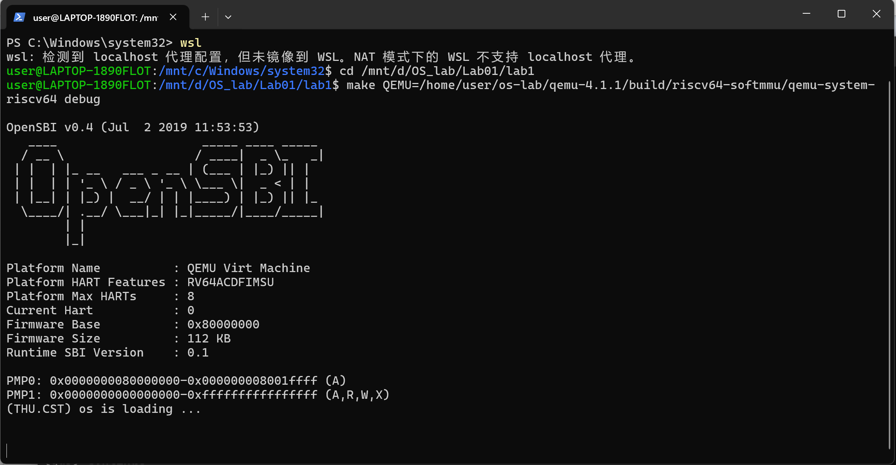

# 操作系统实验报告

## 实验基本信息

| 项目         | 内容                                           |
| ------------ | ---------------------------------------------- |
| **实验名称** | Lab 1: [最小可执行内核]                        |
| **小组成员** | 2412084-刘芳希、2410826-马伊汀、2410439-吴佳璐 |
| **完成日期** | 2026-10-06                                     |

### 小组分工

本实验是第一次操作系统实验，内容虽然比较基础，但涉及环境配置、代码分析、实际运行和结果核对等多个环节。因此，我们没有简单按照“一个人负责一部分报告”的方式分工，而是将工作分为**实验准备、实验实现、结果核对与报告整理**几个方面，同时要求三位成员都在自己的电脑上完整完成实验。

### 小组分工

| 成员               | 负责模块               | 具体工作                                                                                    | 最终产出                                     |
| ------------------ | ---------------------- | ------------------------------------------------------------------------------------------- | -------------------------------------------- |
| **2412084-刘芳希** | 实验流程与报告前期内容 | 梳理实验目的、实验要求、知识点及完整实验流程，明确各实验步骤和操作要求                      | 实验报告**第一、三部分**                     |
| **2410826-马伊汀** | 实验实现与过程记录     | 按照实验流程独立完成实验，记录实验过程，整理实现方法并完成实验截图                          | 实验报告**第四部分**及全部实验截图           |
| **2410439-吴佳璐** | 结果核对与问题分析     | 对三台机器的实验结果进行交叉核对，分析并解决 QEMU、GCC 等环境差异问题，同时整理 AI 协作过程 | 实验报告**第二、五、六部分**及 AI 提示词记录 |

其中，**练习1和2的分析思路和实验流程梳理由刘芳希负责，第四部分的实验实现、截图和成稿由马伊汀负责，实验结果的一致性核对及问题定位心得经验总结和 AI 使用分析由吴佳璐负责**。除此之外，三位成员都按照同一套实验流程，在自己的电脑上独立完成了整个实验，因此实验结果不是由某一位成员单独运行后共享，而是经过三台机器分别验证。

这样的分工主要考虑了两个方面。首先，第一次操作系统实验对环境依赖比较强，三个人分别完成实验，可以验证实验环境和操作步骤是否具有可复现性；其次，我们专门安排一人负责**横向比较三台机器的实验结果**，而不是只检查自己的结果是否正确，这也让一些容易被忽略的问题真正暴露出来。这样既提高了实验效率，也让最终报告中的实验数据和结论有了更充分的依据。

---

## 一、实验目的

本次实验的目标是构建一个最小可执行内核，为后续实验做准备。相对于上百万行的现代操作系统和几千行的 ucore，最小可执行内核只保留内核能够运行所必需的部分：它能够正确地对接到 QEMU 模拟器上并完成启动，能够在控制台进行格式化输出，然后进入死循环。

本次实验实现了最小可执行内核的构成和启动流程。内核运行在 QEMU 模拟的 64 位 RISC-V 计算机上，为了使内核能够正确地与 QEMU 模拟器的启动过程对接，需要了解 QEMU 模拟器的启动流程，以及程序的内存布局和编译流程的相关知识。本实验的主要目的是：

1. 理解最小可执行内核与内核启动流程：掌握从 QEMU 加电复位、OpenSBI 初始化，到控制权移交内核入口 `kern_entry`、再进入 C 语言函数 `kern_init` 的完整执行过程，并理解内核必须被加载到物理地址 `0x80200000` 的原因。
2. 掌握内核镜像的生成方法：使用**链接脚本**描述内核的内存布局和入口点，进行**交叉编译**生成可执行文件，进而生成内核镜像；并使用 OpenSBI 作为 bootloader 加载内核镜像、使用 QEMU 进行模拟运行。
3. 掌握内核的输出与调试方法：使用 OpenSBI 提供的服务，自底向上地封装出能够在控制台进行格式化输出的 `cprintf` 函数，作为后续实验的调试手段；同时掌握使用 GDB 配合 QEMU 远程调试内核的方法，并通过调试验证内核的启动流程。

---

## 二、实验环境

### 2.1 使用的 AI 工具

| 成员           | AI 编程工具            | 底层模型          | 备注 |
| -------------- | ---------------------- | ----------------- | ---- |
| 2412084-刘芳希 | VS Code插件Claude Code | DeepSeek-V4-Flash |      |
| 2410826-马伊汀 | VS Code插件Claude Code | DeepSeek-V4-Flash |      |
| 2410439-吴佳璐 | VS Code插件Claude Code | DeepSeek-V4-Flash |      |


### 2.2 软硬件与工具链

本实验的运行环境如下：

| 项目             | 配置                                                         |
| ---------------- | ------------------------------------------------------------ |
| 宿主机           | Windows                                                      |
| 运行环境         | WSL2，Ubuntu 24.04.4 LTS                                     |
| 目标架构         | RISC-V 64 位（RV64），内核运行于 S 模式                      |
| 模拟器           | **QEMU 4.1.1**（`/opt/qemu-4.1.1/bin/qemu-system-riscv64`）  |
| 模拟平台         | `virt` 机器，内置固件为 **OpenSBI v0.4（Jul 2 2019）**       |
| Runtime SBI 版本 | 0.1                                                          |
| 交叉工具链       | **SiFive Freedom Tools **（`riscv64-unknown-elf-` 前缀）     |
| 交叉编译器       | `riscv64-unknown-elf-gcc` 10.1.0                             |
| 二进制工具       | `riscv64-unknown-elf-ld` / `objcopy` / `objdump` / `readelf` |
| 调试器           | `riscv64-unknown-elf-gdb`                                    |
| 实验目录         | `/mnt/d/OS_CS/OS_lab/Lab01/lab1`                             |

#### （1）交叉工具链

工具链使用课程提供的 **SiFive Freedom Tools** 预编译版本，安装方式为解压后加入 `PATH`：

```shell
# 解压到用户目录
tar xzf riscv64-unknown-elf-gcc-10.1.0-2020.08.2-x86_64-linux-ubuntu14.tar.gz \
        -C ~/riscv-toolchain --strip-components=1

# 加入 PATH（写入 ~/.bashrc）
export PATH=$HOME/riscv-toolchain/bin:$PATH
```

验证安装：

```shell
riscv64-unknown-elf-gcc --version    # riscv64-unknown-elf-gcc (SiFive GCC 10.1.0-2020.08.2) 10.1.0
riscv64-unknown-elf-gdb --version    # GNU gdb (SiFive GDB 9.1.0-2020.08.2) 9.1
```

#### （2）QEMU

实验指导书要求使用 QEMU 4.1.1，因此由源码编译安装（使用独立前缀，不影响系统中存在的其他 QEMU 版本）：

```shell
./configure --prefix=/opt/qemu-4.1.1 \
            --target-list=riscv64-softmmu \
            --disable-werror \
            --python=python3 --disable-docs
make -j8 && sudo make install
```

运行实验时通过 `QEMU=` 参数指定该版本：

```shell
make QEMU=/opt/qemu-4.1.1/bin/qemu-system-riscv64 qemu
```

> **说明**：本组环境与实验指导书的关键指标完全一致——QEMU 4.1.1、内置 OpenSBI v0.4、
> `Runtime SBI Version 0.1`、`Firmware Size 112 KB`、复位入口 5 条指令。
> 其中 QEMU 版本为 4.1.1：其内置固件为 OpenSBI v0.4，
> 较新版本的 QEMU 内置 OpenSBI v1.0，引导行为不同（详见 5.3 节说明）。


---

## 三、实验整体逻辑分析

### 3.1 本章节的逻辑主线

本次实验围绕一个核心主题展开：**最小可执行内核的构成和启动流程**。本次实验对 ucore 的代码做了简化，只保留了内核能够运行所必需的部分，得到一个能够进行格式化输出、随后进入死循环的最小内核；后续实验再在这个基础上一项项地补充和完善功能。


本次实验所解决的核心问题是：**操作系统内核如何被正确地加载到内存中并开始运行**。内核本身是一个程序，而将它加载到内存这一操作没有办法由内核自身完成，因此在内核开始执行之前，必须由另一段程序负责把内核镜像加载到内存，并把 CPU 的控制权移交给内核，这段程序即引导加载程序。在 QEMU 模拟的 RISC-V 计算机上，承担这一角色的是 QEMU 自带的 OpenSBI 固件。为了使内核能够与 OpenSBI 正确对接，需要解决以下两个具体问题：

1. **内核应被加载到哪个地址**：QEMU 的 RISC-V 处理器将复位向量地址初始化为 `0x1000`，PC 从此处开始执行复位代码；复位代码将 OpenSBI 加载到 `0x80000000`，OpenSBI 完成 M 模式下的初始化后，再将内核镜像加载到 `0x80200000`，并把 PC 跳转到该地址。由于编译生成的指令中直接包含访存地址的绝对地址，内核属于地址相关的代码，因此内核入口必须位于物理地址 `0x80200000` 处，这需要通过**链接脚本**来描述内核各段的内存布局和入口点。
2. **内核如何实现输出**：内核不能使用 C 标准库的 `printf`，因为它依赖于已有操作系统提供的运行环境。因此需要从最底层出发，利用 OpenSBI 提供的单字符输出服务，通过内联汇编和 `ecall` 指令调用 SBI 服务，再逐层封装成格式化输出函数 `cprintf`。

### 3.2 功能的逐步实现

本次实验涉及的文件可以按照内核实际的启动顺序串起来，即“**内存布局 → 汇编入口 → 编译链接 → 内核初始化 → 输出封装 → 调试验证**”。这一顺序与代码的执行顺序一致，因此可以逐层分析，各部分的作用也比较容易分别验证：

1. **链接脚本 `tools/kernel.ld`**：该文件指定输出文件的架构为 riscv、入口点为 `kern_entry`、加载地址为 `0x80200000`，并通过 `SECTIONS` 指令将输入文件的各段依次组合为输出文件的 `.text`、`.rodata`、`.data`、`.sdata` 和 `.bss` 段。它在整个启动流程中处于最基础的位置，因为内存布局决定了后续所有代码的地址，是 OpenSBI 能够正确定位并跳转到内核入口的前提。
2. **汇编入口 `kern/init/entry.S`**：该文件定义了全局符号 `kern_entry`，其中 `la sp, bootstacktop` 设置内核栈指针，`tail kern_init` 跳转到 C 语言实现的内核初始化函数；同时它在 `.data` 段中按页对齐预留 `KSTACKSIZE`（2 个页，共 8 KiB）的内核栈空间。内核启动时并没有可用的栈，而 C 语言函数的调用、局部变量和返回地址都需要栈的支持，因此必须先建立栈环境，才能进入 C 代码。
3. **构建脚本 `Makefile` 和 `tools/function.mk`**：这两个文件将“编译所有源码 → 链接生成 ELF 文件 `bin/kernel` → 通过 `objcopy` 转换成 bin 内核镜像 `bin/ucore.img` → 使用 QEMU 加载运行”这一系列步骤自动化。这样安排的原因在于：内核镜像的生成涉及交叉编译和多个链接步骤，手工执行既烦琐又容易出错。
4. **内核初始化函数 `kern_init`**：该函数首先利用链接器提供的符号 `edata` 和 `end` 将 `.bss` 段清零，为未初始化的全局变量赋零值；随后调用 `cprintf` 输出一行信息；最后进入死循环。这是内核第一次执行 C 代码，也是内核向开发者反馈其运行状态的方式。
5. **输出功能的分层实现**：`libs/sbi.c` 中使用内联汇编将功能号和参数分别装入 `x17`、`x10` 等寄存器，执行 `ecall` 指令请求 OpenSBI 服务，封装出单字符输出函数 `sbi_console_putchar`；`kern/driver/console.c` 中的 `cons_putc` 对其再做一层封装；`kern/libs/stdio.c` 在此基础上提供 `cputch`、`cputchar` 和 `cputs`；最后由 `libs/printfmt.c` 完成格式化输出，并由 `kern/libs/stdio.c` 提供 `cprintf`。这种分层结构将跨特权级的服务调用与上层的格式化字符串处理分离，使每一层只依赖于下一层的接口，便于分析和移植。
6. **GDB 配合 QEMU 的远程调试**：通过调试验证从复位地址 `0x1000` 到内核入口 `0x80200000`、再到 `kern_init` 的完整启动过程。将调试验证放在最后，是因为前面的各部分都需要实际运行才能得到验证；而 GDB 能够观察虚拟 CPU 内部的状态，从而确认控制权在何时、以何种方式移交给内核。


---

## 四、实验内容与实现

<!-- 
说明：本部分按照 exercises 文档中的练习顺序组织
每个功能模块或者练习中可能包含多项任务，请根据实际情况调整
-->

### 练习1：理解内核启动中的程序入口操作

**负责人：** 2412084-刘芳希

#### （1）`la sp, bootstacktop` 完成的操作

`la` 是 RISC-V 汇编器提供的加载地址伪指令，作用是把符号 `bootstacktop` 的地址计算并装入寄存器 `sp`。汇编器通常会根据目标地址把它展开为若干条实际指令，例如基于 `auipc` 和 `addi` 的地址计算指令。它并不是把栈中的数据加载到 `sp`，而是把内核启动栈的栈顶地址写入栈指针寄存器。

根据 `kernel.sym`，当前实验产物中：

- `bootstack` 地址为 `0x80201000`；
- `bootstacktop` 地址为 `0x80203000`；
- 内核启动栈大小为 `0x2000` 字节。

因此，这条指令执行后，`sp = 0x80203000`。RISC-V 的栈从高地址向低地址增长，将栈顶地址放入 `sp` 后，后续的函数调用、返回地址保存、局部变量和寄存器的保存才有了可用的空间。

这条指令的目的主要有两点：

1. 建立内核启动阶段可用的栈环境；
2. 为从汇编代码进入 C 语言函数提供符合调用约定的运行条件。

如果不初始化 `sp`，后续的函数调用可能会向未定义的地址保存数据，导致内核无法正常执行。

#### （2）`tail kern_init` 完成的操作

`tail kern_init` 是尾调用形式的跳转伪指令，作用是把控制流转移到 `kern_init`，而不是像普通 `call` 一样建立一个需要返回的调用关系。它通常会被展开为计算目标地址并跳转的指令，跳转后由 `kern_init` 继续执行。

它的目的是把内核入口的控制权交给 C 语言编写的初始化函数。`kern_entry` 是内核的启动入口，并不是由普通函数调用的函数；内核初始化完成后也不会返回到某个调用者，而是继续运行。因此使用尾跳转可以避免保存不必要的返回地址，也符合内核入口只需单向跳转、无需返回的执行特点。

此后内核在 `kern_init` 中清零数据区、输出 `(THU.CST) os is loading ...`，并进入死循环。

### 练习2：使用 GDB 验证启动流程

#### 调试过程记录

##### （1）启动 QEMU 调试模式

首先进入实验目录，使用实验指定版本的 QEMU 启动调试模式：

```shell
cd /mnt/d/OS_CS/OS_lab/Lab01/lab1
make QEMU=/opt/qemu-4.1.1/bin/qemu-system-riscv64 debug
```

其中，`debug` 目标会为 QEMU 追加以下调试参数（`Makefile` 中对应 `-s -S`）：

- `-S`：表示 CPU 启动后立即暂停，等待调试器发出指令；
- `-s`：表示开放 `1234` 端口（等价于 `-gdb tcp::1234`），等待 GDB 连接。

##### （2）启动 GDB 并连接 QEMU

重新打开一个 WSL 终端，进入实验目录，启动 RISC-V 交叉编译工具链中的 GDB：

```shell
cd /mnt/d/OS_CS/OS_lab/Lab01/lab1
riscv64-unknown-elf-gdb ./bin/kernel
```

进入 GDB 后，设置目标架构并连接 QEMU：

```shell
set architecture riscv:rv64
set pagination off
target remote :1234
```

连接成功后，GDB 显示：

```shell
Remote debugging using :1234
0x0000000000001000 in ?? ()
```

这说明当前程序计数器 PC 的值为 `0x1000`。



##### （3）观察复位地址处的指令

用 `info registers pc` 查看当前 PC，输出为 `pc 0x1000 0x1000`：


再用 `x/10i 0x1000` 查看 `0x1000` 地址处的指令，观察到：

```shell
0x1000: auipc t0,0x0
0x1004: addi  a1,t0,32
0x1008: csrr  a0,mhartid
0x100c: ld    t0,24(t0)
0x1010: jr    t0
```



这些指令位于 QEMU 模拟的 RISC-V 复位入口处，属于 QEMU 在复位地址处写死的一小段固件代码（MROM）。它们是内核启动过程中最早执行的一段代码，作用是把 PC 从复位向量引导到 OpenSBI 的入口，此后 CPU 在 `0x80000000` 处继续运行 OpenSBI：

| 指令地址 | 指令              | 完成的操作                                                        |
| -------- | ----------------- | ----------------------------------------------------------------- |
| `0x1000` | `auipc t0,0x0`    | 取当前 PC 的值到 `t0`，得到复位入口的基地址                       |
| `0x1004` | `addi a1,t0,32`   | 由基地址算出启动参数所在的地址，存入 `a1`，用于向后续固件传递参数 |
| `0x1008` | `csrr a0,mhartid` | 读取当前硬件线程（hart）的 ID，存入 `a0`                          |
| `0x100c` | `ld t0,24(t0)`    | 从复位入口附近的固定位置读出 OpenSBI 的入口地址                   |
| `0x1010` | `jr t0`           | 跳转到 `t0` 指向的地址，即把控制权交给 OpenSBI 的初始化代码       |

`0x1014` 之后显示的 `unimp` 等内容并没有被执行，它们属于复位入口附近的数据或填充内容。

##### （4）在内核入口设置断点

由于 OpenSBI 的代码量较大，逐条单步跟踪效率较低，因此我们采用在内核入口地址处设置断点的方法，随后继续运行：

```shell
b *0x80200000
continue
```

GDB 成功停在：

```shell
Breakpoint 1, kern_entry () at kern/init/entry.S:7
pc  0x80200000  0x80200000 <kern_entry>
```

这说明 OpenSBI 已经完成初始化，并成功跳转到内核入口 `0x80200000`。再用 `x/10i $pc` 查看内核入口处的指令：

```shell
0x80200000 <kern_entry>:    auipc sp,0x3
0x80200004 <kern_entry+4>:  mv    sp,sp
0x80200008 <kern_entry+8>:  j     0x8020000a <kern_init>
```

这些指令是 `entry.S` 中 `la sp, bootstacktop` 和 `tail kern_init` 两条伪指令展开后的结果，其作用是设置内核栈指针，并跳转到 `kern_init`，开始执行内核初始化代码。

本步骤对应的核心函数是 `kern_entry`。它是链接脚本中通过 `ENTRY(kern_entry)` 指定的程序入口，也是内核的第一条指令所在的位置。`kern_entry` 本身只有两条指令：`la sp, bootstacktop` 把内核启动栈的栈顶地址装入 `sp`，为后续 C 语言函数的调用、局部变量和返回地址的保存提供栈空间；`tail kern_init` 以尾跳转的方式把控制权交给 `kern_init`。由于内核入口不需要返回，`tail` 跳转不会在栈上保存返回地址，这也与 `kern_entry` 只负责建立运行环境、随后不再被调用的性质相符。至此，内核的执行流程从汇编代码转入 C 语言代码。



##### （5）观察运行结果

本次实验观察到：RISC-V 复位地址为 `0x1000`，内核入口地址为 `0x80200000`，内核运行在 S-mode。

RISC-V 硬件加电后，CPU 首先从 `0x1000` 开始执行复位入口代码。复位代码读取硬件线程 ID、准备启动参数，并跳转到 OpenSBI。OpenSBI 随后完成机器模式下的基础初始化，包括异常和中断配置、PMP 配置，以及定时器、串口等 SBI 服务的初始化。最后，OpenSBI 将 CPU 切换到 S-mode，并跳转到 `0x80200000`，将控制权交给内核。

QEMU 终端中的输出表明，OpenSBI 已成功启动并完成了基本的平台初始化，内核随后输出了 `(THU.CST) os is loading ...`：



##### （6）进入 `kern_init` 函数

在内核入口 `0x80200000` 处确认内核开始执行后，使用函数名设置断点：

```shell
b kern_init
```

GDB 输出 `Breakpoint 2 at 0x8020000a: file kern/init/init.c, line 8.`，这说明符号 `kern_init` 的地址为 `0x8020000a`。继续运行程序 `continue`，GDB 停在：

```shell
Breakpoint 2, kern_init () at kern/init/init.c:8
8           memset(edata, 0, end - edata);
```

由此可知，内核已经从 `kern_entry` 跳转到 `kern_init` 函数，并开始执行内核初始化代码。当前执行的语句是 `memset(edata, 0, end - edata);`，该语句用于将内核的未初始化数据段（`.bss` 段）清零，使未初始化的全局变量取值为零，为后续内核运行准备一致的内存环境。此时的启动过程为：

```text
0x1000
  ↓
OpenSBI 初始化
  ↓
0x80200000 kern_entry
  ↓
0x8020000a kern_init
```



随后使用 `info registers ra sp gp tp` 和 `disassemble /m kern_init` 查看 `kern_init` 的寄存器和反汇编信息，其中 `ra` 表示返回地址，`sp` 表示栈指针，`gp` 表示全局指针，`tp` 表示线程指针。反汇编结果可以用于进一步分析 `kern_init` 中对内存初始化、输出函数调用以及循环跳转的具体实现：



本步骤对应的核心函数是 `kern_init`，它是内核的 C 语言入口。从反汇编结果可以看到它承担的两项工作：一是用 `memset(edata, 0, end - edata)` 将通过链接脚本符号 `edata` 与 `end` 界定出的 `.bss` 段清零，使未初始化的全局变量取值为零，从而使内核的内存环境与 C 语言的语义一致；二是调用 `cprintf` 输出 `(THU.CST) os is loading ...`，这是内核第一次向控制台输出信息，也说明前面各层输出函数（`cprintf` → `vcprintf` → `vprintfmt` → `cputch` → `cons_putc` → `sbi_console_putchar` → `ecall`）已经可以正常工作。该函数最后以 `while (1);` 进入死循环，其反汇编形式是一条跳转到自身的 `j` 指令（`0x8020003a`），内核此后不再返回，这与内核入口无需返回的性质是一致的。

##### （7）最终运行结果

切换回运行 QEMU 的终端，观察内核的完整输出：



#### 调试观察结果与问题答案

1. **RISC-V 硬件加电后最初执行的几条指令位于什么地址？**

   RISC-V 硬件加电后，CPU 首先从复位地址 `0x1000` 开始执行指令。通过 GDB 观察到，最初几条指令分别位于 `0x1000`、`0x1004`、`0x1008`、`0x100c` 和 `0x1010`，共 5 条。这几条指令是 QEMU 在复位入口处预置的一小段引导代码，它把 PC 从复位向量引导到 OpenSBI 的入口，之后 CPU 便在 `0x80000000` 处继续运行 OpenSBI。本机实测（`x/8i 0x1000`）的完整输出为：

   ```text
   => 0x1000:  auipc t0,0x0
      0x1004:  addi  a1,t0,32
      0x1008:  csrr  a0,mhartid
      0x100c:  ld    t0,24(t0)
      0x1010:  jr    t0
      0x1014:  unimp
      0x1016:  unimp
      0x1018:  unimp
   ```

   即有效指令共 5 条，`0x1014` 起为数据或填充内容，不会被执行。

2. **复位阶段的指令主要完成什么功能？**

   这五条指令依次完成：用 `auipc t0,0x0` 获取当前代码位置（从而得到复位入口的基地址）；用 `addi a1,t0,32` 准备好一个指向启动参数的地址，作为参数传给后续固件；用 `csrr a0,mhartid` 读取当前硬件线程（hart）的 ID；用 `ld t0,24(t0)` 从复位入口附近的固定位置读出 OpenSBI 的入口地址；最后用 `jr t0` 跳转到 OpenSBI，进入固件初始化流程。`0x1014` 之后的 `unimp` 等指令实际并不会被执行。

   可以进一步印证：启动日志中 OpenSBI 自报 `Firmware Base : 0x80000000`，
   与 `ld t0,24(t0)` 读出的跳转目标一致，说明这段引导代码的作用正是把控制权交给 OpenSBI。

---

## 五、测试与验证

本实验的验证分为三层：
**编译产物验证**（静态，检查地址与段布局）、
**运行结果验证**（动态，检查内核是否真的执行并输出）、
**调试过程验证**（用 GDB 核对控制权的移交路径）。三层证据互相印证，
且所有数值均可由本组实测复现（复现命令见附录《环境适配与复刻记录》第八节）。

### 5.1 编译验证

在实验目录下执行：

```shell
make clean && make
```

编译过程无 error、无 warning（`Makefile` 中已开启 `-Werror`），退出码为 0。
生成的内核镜像为：

| 产物            | 大小       | 说明                                                       |
| --------------- | ---------- | ---------------------------------------------------------- |
| `bin/kernel`    | 43344 字节 | ELF 可执行文件，含符号信息，供 GDB 使用                    |
| `bin/ucore.img` | 12296 字节 | 由 `objcopy` 从 `bin/kernel` 转换而来，QEMU 实际加载的镜像 |

用 `readelf` 检查 ELF 头部，确认入口地址正确：

```shell
riscv64-unknown-elf-readelf -h bin/kernel | grep -E 'Class|Machine|Entry'
```

```text
Class:                             ELF64
Machine:                           RISC-V
Entry point address:               0x80200000
```

即链接脚本 `tools/kernel.ld` 中的 `BASE_ADDRESS = 0x80200000`
与 `ENTRY(kern_entry)` 均已生效。

### 5.2 启动地址与符号交叉核对

内核的地址数据来自三个相互独立的来源，本组逐一核对，结果完全一致，
排除了单一来源出错的可能：

| 核对项                  | QEMU 启动日志                | GDB 现场观察                | `obj/kernel.sym` 符号表 |
| ----------------------- | ---------------------------- | --------------------------- | ----------------------- |
| 复位入口                | —                            | `pc = 0x1000`               | —                       |
| OpenSBI 固件基址        | `Firmware Base : 0x80000000` | —                           | —                       |
| 内核入口 `kern_entry`   | —                            | `0x80200000`（断点 1 命中） | `0x80200000`            |
| C 入口 `kern_init`      | —                            | `0x8020000a`（断点 2 命中） | `0x8020000a`            |
| 内核栈底 `bootstack`    | —                            | —                           | `0x80201000`            |
| 内核栈顶 `bootstacktop` | —                            | `sp = 0x80203000`           | `0x80203000`            |
| 数据段结束 `edata`      | —                            | `0x80203008`                | `0x80203008`            |
| 内核结束 `end`          | —                            | `0x80203008`                | `0x80203008`            |

其中 `bootstacktop − bootstack = 0x2000` 字节（8 KiB），
与 `memlayout.h` 的 `KSTACKPAGE = 2` 和 `mmu.h` 的 `PGSIZE = 4096` 相符。

### 5.3 运行验证

执行 `make QEMU=/opt/qemu-4.1.1/bin/qemu-system-riscv64 qemu`，
QEMU 终端输出如下：

```text
OpenSBI v0.4 (Jul  2 2019 11:53:53)
   ____                    _____ ____ _____
  / __ \                  / ____|  _ \_   _|
 | |  | |_ __   ___ _ __ | (___ | |_) || |
 | |  | | '_ \ / _ \ '_ \ \___ \|  _ < | |
 | |__| | |_) |  __/ | | |____) | |_) || |_
  \____/| .__/ \___|_| |_|_____/|____/_____|
        | |
        |_|

Platform Name          : QEMU Virt Machine
Platform HART Features : RV64ACDFIMSU
Platform Max HARTs     : 8
Current Hart           : 0
Firmware Base          : 0x80000000
Firmware Size          : 112 KB
Runtime SBI Version    : 0.1

PMP0: 0x0000000080000000-0x000000008001ffff (A)
PMP1: 0x0000000000000000-0xffffffffffffffff (A,R,W,X)
(THU.CST) os is loading ...
```

**判定标准与结论**：

| 检查项                 | 期望值                   | 实际结果                      | 是否通过 |
| ---------------------- | ------------------------ | ----------------------------- | -------- |
| OpenSBI 是否完成初始化 | 打印平台信息             | 完整打印                      | 是       |
| OpenSBI 固件基址       | `0x80000000`             | `0x80000000`                  | 是       |
| 内核是否被执行         | 输出一行信息             | `(THU.CST) os is loading ...` | 是       |
| 输出内容是否与源码一致 | 与 `init.c` 中字符串相同 | 完全一致                      | 是       |
| 输出后是否进入死循环   | 终端停在原地、不再输出   | 光标停住不再输出              | 是       |


### 5.4 关于 `make grade`

`Makefile` 中定义了 `grade` 目标，但它依赖 `tools/grade.sh`，
而本组实验目录中**不包含该脚本**（`tools/` 下仅有 `function.mk` 与 `kernel.ld`）：

```text
$ make grade
sh: 0: cannot open tools/grade.sh: No such file
make: *** [Makefile:204: grade] Error 2
```

因此本实验未使用 `make grade` 进行自动评分，而是采用上述三层验证方式：
**编译产物检查 + 启动地址交叉核对 + QEMU 实际运行 + GDB 逐步调试**。
这四类证据（ELF 头、符号表、QEMU 输出、GDB 现场值）共同验证了
"内核被正确加载到 `0x80200000` 并开始执行"这一实验目标已经达成。

### 5.5 测试结论

1. **编译通过**：`make` 无 error、无 warning，产物大小与预期相符；
2. **地址正确**：ELF 入口点、链接脚本、符号表、GDB 现场值四者一致，
   内核入口确为物理地址 `0x80200000`；
3. **启动成功**：QEMU 中 OpenSBI 完成 M 模式初始化，
   并将控制权移交内核，内核正确输出目标字符串；
4. **流程可证**：通过 GDB 断点依次命中 `0x1000` → `0x80200000` → `0x8020000a`，
   完整复现了"复位 → OpenSBI → 汇编入口 → C 入口"的启动流程；
5. **行为正确**：内核在输出后进入死循环，符合最小可执行内核的设计预期。

---


## 六、实验总结与收获

### 6.1 对操作系统的理解

#### （1）从“知道概念”到“看到系统真正运行起来”

在动手实验之前，我们对内核的理解更多停留在概念层面：内核负责管理内存、进程和设备，是操作系统中处于最底层的核心部分。但通过本次实验，我们第一次比较完整地看到，一个内核究竟是如何从一个文件逐步变成正在运行的程序的。

在启动最初的阶段，内核实际上还没有“运行”起来，它只是 `bin/ucore.img` 中的一个二进制文件。QEMU 首先将其加载到约定的物理地址 `0x80200000`，随后由 OpenSBI 将处理器的控制权交给内核。从 GDB 中逐条跟踪指令后，我们才真正理解了“引导程序加载内核并移交控制权”这句话背后的具体过程。

这也让我们重新认识了引导程序的作用。它并不是启动流程中一个可以一带而过的环节，而是内核能够运行起来的必要前提。在本实验环境中，这一过程受到几个明确约束：内核需要被加载到 `0x80200000`，入口地址通过链接脚本中的 `ENTRY(kern_entry)` 指定，而在进入 C 语言代码之前，还必须通过 `la sp, bootstacktop` 建立栈环境。也就是说，操作系统的运行环境并不是“天然存在”的，而是需要经过一系列明确的初始化步骤逐步建立起来。

另一个比较直观的收获来自对输出函数的跟踪。内核中的一条 `(THU.CST) os is loading ...`，并不是像普通 C 程序中的 `printf` 一样直接完成输出，而是经过 `cprintf` → `vcprintf` → `vprintfmt` → `cputch` → `cons_putc` → `sbi_console_putchar` → `ecall` 等多层调用，最终通过陷入机制请求更高特权级的固件完成输出。以前我们认为理所当然的“打印一句话”，在内核环境中其实需要经过完整的软件分层和特权级协作。

通过这些具体的代码、地址和指令，我们对操作系统的理解也从“记住若干概念”进一步转变为“能够把概念和实际运行过程对应起来”。这可能是本次实验最重要的收获之一。

#### （2）本实验的知识点与 OS 原理知识点的对应关系

本次实验中，我们将实际观察到的现象与操作系统原理课程中的相关知识进行了对应：

| 本实验中的知识点                                                | 对应的 OS 原理知识点           | 含义、关系与差异                                                                                                                                                                                                                       |
| --------------------------------------------------------------- | ------------------------------ | -------------------------------------------------------------------------------------------------------------------------------------------------------------------------------------------------------------------------------------- |
| `0x1000` 复位入口 → OpenSBI → 内核入口 `0x80200000`             | **操作系统的引导与内核加载**   | 课程中通常将其概括为“引导程序将内核加载到内存并移交控制权”。本次实验则通过 GDB 逐步观察了这一过程。在真实计算机中通常由 BIOS/UEFI、Bootloader 等承担相关职责，而在 QEMU 的 RISC-V 环境中，则体现为复位入口、OpenSBI 与内核之间的配合。 |
| `tools/kernel.ld` 的段布局、`BASE_ADDRESS`、`ENTRY(kern_entry)` | **程序的内存布局、链接与加载** | 课程中的地址空间通常会结合虚拟内存和页表进行理解，而本实验早期阶段尚未开启分页，代码所使用的地址就是实际运行阶段使用的物理地址。因此，`0x80200000` 等地址能够较直接地对应到程序在内存中的实际位置。                                    |
| OpenSBI 运行于 M 模式，内核运行于 S 模式                        | **特权级与模式切换**           | 课程中常用“用户态/内核态”进行概括，而 RISC-V 实际提供 M、S、U 等多个特权级。本实验中，内核运行在 S 模式，而更高特权级的 OpenSBI 负责提供底层服务，使我们对特权级之间的关系有了更具体的认识。                                           |
| `cprintf` 到 `ecall` 的多层调用                                 | **I/O 与设备驱动的分层设计**   | `printfmt.c` 负责格式化输出，`cputch`、`cons_putc` 等进一步完成字符输出，底层再通过 SBI 与固件交互。不同层次各自承担相对独立的职责，体现了操作系统 I/O 子系统的分层思想。                                                              |
| 内核入口处的 `la sp, bootstacktop`                              | **函数调用约定与运行时环境**   | C 函数调用依赖栈保存返回地址、局部变量等信息，而进入 C 语言环境之前栈并不会自动存在。本实验中由启动代码显式设置 `sp`，使内核获得最基本的函数调用环境。                                                                                 |

通过上述对应，我们发现，操作系统原理课程中的许多知识并不是孤立存在的。地址空间、特权级、陷入、I/O 分层等概念，最终都会落实到具体的指令、寄存器和内存地址上。实验提供了一个将抽象理论“落地”的过程。

#### （3）OS 原理中重要但本实验尚未涉及的内容

本次实验主要围绕内核启动、内存布局、特权级切换以及基本 I/O 展开，实际上只涉及了操作系统运行机制的一个起点。结合操作系统原理课程已经学习的内容，我们发现，许多真正体现操作系统核心功能的机制还没有在本实验中展开。这些内容也让我们对后续学习有了更加清晰的认识。

1. **进程与进程上下文切换**

   本实验从启动到最后的 `while (1);` 始终只有一个执行流，没有创建和管理多个进程，也没有发生进程之间的切换。因此，课程中学习的进程概念、进程状态以及进程上下文切换，在本次实验中还没有具体体现。尤其是上下文切换需要保存和恢复寄存器、栈指针等处理器运行状态，这也是后续实验需要进一步观察和实现的内容。

2. **进程调度**

   由于本实验只有一个执行流，因此不存在多个进程竞争 CPU 的情况，也就没有就绪队列、时间片和调度策略。课程中学习的先来先服务等调度算法，本质上都是在解决“多个可运行进程如何共享处理器”的问题，而这一问题在当前实验中还没有出现。

3. **内存管理**

   本实验已经涉及程序的内存布局，并能够看到代码、数据和栈在实际内存中的位置，但这与操作系统意义上的内存管理还有明显区别。当前内核并没有对多个进程使用的内存进行统一分配、回收和管理，课程中涉及的内存分配与管理机制也尚未在本实验中展开。

4. **分页机制与虚拟内存**

   本实验尚未开启分页机制，程序使用的地址可以直接对应到实际的物理内存位置，因此还没有涉及页表、虚拟地址到物理地址的转换以及页面映射等内容。

5. **并发与同步**

   本实验只有一个执行流，不存在多个进程或线程同时访问共享资源的情况，因此也不会产生典型的竞态条件和临界区问题。课程中的并发、互斥与同步机制，需要建立在多个执行流同时存在的基础上，而本次实验还处于单执行流的阶段。

总体来看，本次实验是后续操作系统实验的基础。我们首先解决的是“**内核如何被加载、从哪里开始执行，以及如何建立最基本的运行环境**”；而课程中后续学习的进程切换、进程调度、内存管理、分页、换页、多进程内存管理以及进程间通信，则是在这一基础上逐步解决“多个执行实体如何运行、如何共享 CPU、如何使用和隔离内存，以及如何进行数据交换”等问题。

通过这样的对照，我们也更加清楚地认识到，本次实验虽然代码量不大，但实际上处于整个操作系统运行机制的起点。后续课程中的许多复杂机制，最终都可以追溯到本次实验已经接触到的处理器、内存、寄存器、特权级和运行环境这些基础要素。


### 6.2 AI 协作开发的经验

本次实验中，我们使用了 AI 辅助理解代码、讲解知识点、定位实验过程出现的问题和整理实验过程。通过这次实验，我们逐渐形成了一种比较明确的使用方式：**让 AI 帮我们提高分析和理解的效率，但最终结论必须结合实际代码、运行结果和实验环境进行验证。**

#### 1. 用 AI 梳理代码和理解操作系统启动流程

刚开始接触实验代码时，我们对 RISC-V 的启动流程、OpenSBI、`kern_entry` 以及 SBI 调用之间的关系并不是很清楚。因此，我们首先让 AI 根据实验代码帮助我们梳理启动过程和函数调用关系。

例如，在分析 `libs/sbi.c` 中的 `sbi_call` 时，我们让 AI 解释其中各个寄存器的作用以及 `ecall` 的执行过程。这个过程中我们发现，AI 最初按照较新的 SBI v0.2+ 接口进行了说明，将扩展号、功能号分别对应到 `a7`、`a6` 等寄存器。但进一步结合实验环境后发现，本实验使用的是 OpenSBI v0.4，对应的实际上是 legacy SBI v0.1 接口，功能号直接使用 `x17`，参数使用 `x10`、`x11`、`x12`。

这个过程让我们认识到，**AI 很适合帮助我们快速理解陌生代码和知识点，但它给出的解释必须结合具体版本进行判断**。尤其是操作系统、编译器、OpenSBI 这类底层软件，不同版本之间可能存在明显差异，不能因为 AI 的解释完整、合理，就直接认为它一定适用于当前实验环境。

#### 2. 用 AI 分析实验日志，定位 QEMU 环境问题

实验过程中，我们组有一位同学一开始没有完全按照实验指导书来配置环境，而是直接使用了《编译系统原理》课程安装的 QEMU 7.0.0，该版本自带 OpenSBI v1.0，而本实验要求的是 QEMU 4.1.1 和 OpenSBI v0.4。

她开始运行实验时，QEMU 和 OpenSBI 都能够正常启动，但内核始终没有输出。我们一开始主要检查代码和启动流程，没有马上想到是环境版本的问题。后来我们把 QEMU 的启动信息交给 AI，让它结合日志分析可能的原因。AI 注意到了 OpenSBI 输出中的 `Domain0 Next Address = 0x0`，并结合我们使用的 QEMU 和 OpenSBI 版本，判断可能存在实验环境不匹配的问题。

随后她换成实验要求的 QEMU 4.1.1，内核就能够正常启动。这个过程中，AI 并没有直接“修好”实验，而是帮助我们从一大段启动日志中快速找到值得关注的信息，再由我们结合实验要求和实际环境进行验证。

#### 3. 用 AI 比较实验数据，发现 GCC 版本导致的地址差异

解决 QEMU 问题后，实验已经可以正常运行，但在整理实验数据时，AI 又帮助我们发现了另一个比较容易被忽略的问题。

这位同学使用的是通过 `apt` 安装的 `riscv64-unknown-elf-gcc` 13.2.0，而课程要求使用的是 SiFive Freedom Tools v2020.08.2，其中 GCC 版本为 10.1.0。我们把她的实验结果和另外两位同学的结果交给 AI 进行对比，AI 很快发现部分函数地址存在差异，例如她的 `memset` 位于 `0x80200490`，而另外两人的结果是 `0x802004ae`；她的 `cprintf` 位于 `0x80200054`，而正常结果是 `0x80200056`，前后分别相差 `0x1e` 和 `0x2` 字节。

进一步分析后，AI 指出这种差异很可能与 GCC 版本不同导致的代码布局变化有关。我们随后检查实际使用的编译器版本，并换回课程要求的 GCC 10.1.0 重新编译，发现函数地址重新与其他同学的结果对应起来。

这个过程让我们比较直观地体会到了 AI 在**数据比较和异常发现**方面的优势。像 `0x80200490` 和 `0x802004ae` 这样的地址，人直接看很容易觉得只是“差了一点”，但 AI 可以快速计算出具体差值，再结合多个函数的变化寻找共同原因。因此，后来遇到类似问题时，我们会把实际运行结果、地址和日志一起交给 AI，让它先帮助我们寻找异常和可能的规律，再由自己回到代码和实验环境中进行验证。


总体来看，本次实验中 AI 对我们最大的帮助并不是直接给出一个“正确答案”，而是帮助我们更快地从大量代码、日志和实验数据中找到线索。尤其是在版本差异、启动异常和地址变化这些问题上，AI 能够快速完成比较和分析。但与此同时，我们也更加明确了 AI 的局限：**AI 可以帮助我们发现问题、提出假设，但不能代替实验本身。**

因此，通过这次实验，我们最终形成了一种比较可靠的使用方式：**让 AI 做解释、梳理、比较和辅助定位，让自己负责观察、验证和判断。**


